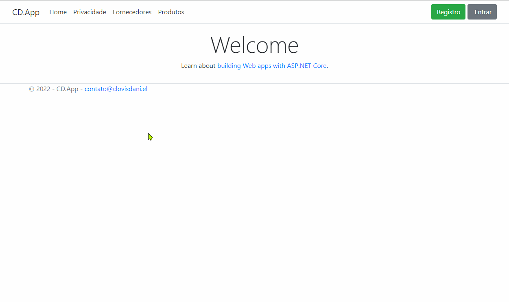

<h1 align="center">
:small_red_triangle_down: Full MVC App 
</h1>

  

<h2 align="center">
Dominando ASP.NET MVC Core by <b>Desenvolvedor.io</b>
</h2>

  

This repository was created as part of course "Dominando ASP.NET MVC Core" by <b>Desenvolvedor.io</b> and it's purpose is building a full ASP.NET MVC Core Application with modern, secure and clean code. This is a system of Suppliers and Products with Identity authentication.

  

